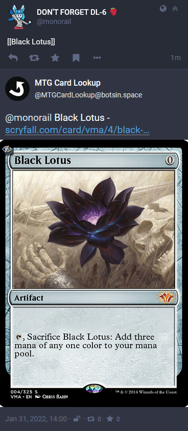
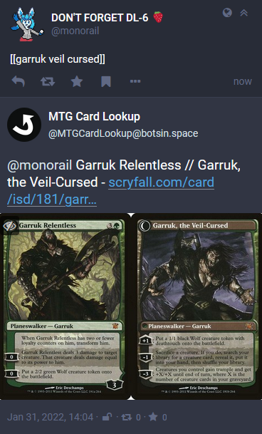

# mtg-card-lookup

A fediverse bot to look up Netrunner cards.

In progress of development right now, the current version is a clone of https://git.hollymcfarland.com/monorail/mtg-card-lookup whidch searches magic cards. Once it's setup, it'll do netrunner cards instead (with any luck).

To use, mention the bot with a message that contains at least one Magic card name wrapped in either [[square brackets]] or {{curly braces}}. It will search Scryfall for the card and reply with the result. Alternatively, follow the bot, and it will follow you back. Any posts it sees with that syntax in its home timeline will also be processed.

See it in action [here](https://botsin.space/@mtgcardlookup)!

## Features

- Automatically keeps its follower and following lists synced
    - Follows back accounts instantly, unfollows every 5 minutes (API restriction)
- If four or less cards are requested, includes images of each card with Oracle text in the description
    - Double Faced Card images are handled by combining both faces into a single image
- Uses fuzzy searching to correct shortenings where possible
- Replies at the same privacy level as it was called with, or unlisted, whichever is more restrictive
- Includes pinned status management (see "Installation and Setup")
    - Unpins all current statuses, then posts a pre-written thread and pins each new status in reverse order

## Installation and Setup

- Clone this repository and create a python environment however you like to
- Install dependencies with `pip install -r requirements.txt`
- Install and enable the included mtgcardlookup.service with systemd, replacing the `ExecStart`, `WorkingDirectory`, and `User` values with those for your system
- [OPTIONAL] Write an introduction thread to be pinned
    - Create a new file called pinned_thread.txt
    - Write each status of the introduction thread, separated by `\n-----\n`
    - Run `./mtgcardlookup --update-pins`. The thread will be posted and pinned
    - In the future, you can modify pinned_thread.txt and rerun the command. The existing thread will be unpinned and the modified one will be posted and pinned.